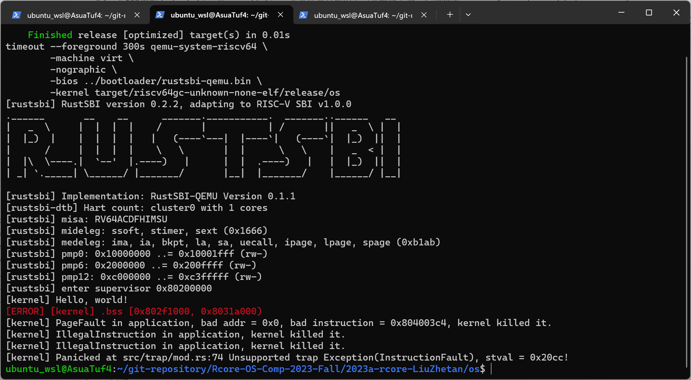

# Chapter 3

## 编程作业

在TCB中加入start_time和syscall_times两个成员分别用于记录程序首次运行的时间和系统调用的次数，start_time在进程首次调度运行的时候设置，syscall_times在trap_handle中系统调用的处理入口，对当前进程TCB的syscall_times计数。

## 简答作业

1. 运行ch2b_bad_address/instruction/register.rs, 查看运行结果

    

2. 深入理解 trap.S 中两个函数__alltraps和__restore 的作用，并回答如下问题：

    1. a0是__restore的第一个参数，是进程TrapContext的地址，__restore可以用于进程执行系统调用后从S态返回，也可以用于内核调度并切换进程。
    2. L43-L48的这段代码用于将存储在TrapContext中的sstatus、sepc写入相应的寄存器中，并将用户栈指针写入到sscratch，最后将使用csrrw将sp切回用户栈。
    3. x4暂时不用到，x2是sp，会在最后保存。
    4. L60的csrrw指令后：sp->user stack, sscratch->kernel stack
    5. __restore中使用sret指令切回用户态
    6. L13csrrw指令后：sp->kernel stack, sscratch->user stack
    7. U进入S态使用ecall指令
